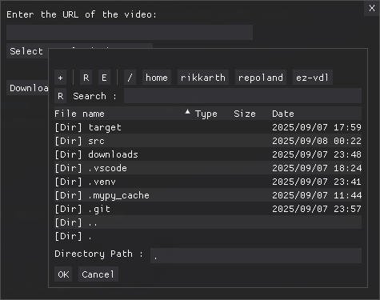

# ez-vdl (Easy Video Downloader)

**ez-vdl** is a simple command-line or GUI tool to download videos by providing the URL containing the video. It uses [yt-dlp](https://github.com/yt-dlp/yt-dlp) under the hood for reliable video downloads.



# Features

- Download videos via URL, currently optimized for X (formerly Twitter)
- Minimal, interactive CLI
- Simple GUI for easy usage
- Cross-platform (Linux, MacOS, Windows planned)
- Standalone binary builds for easy distribution (Linux, MacOS, Windows planned)

# Usage

Run the tool from the command line:

```bash
./ez-vdl [options]
```

Or directly from the source code:
```bash
uv run src/main.py [options]
```

## Command-line Options

```
usage: main.py [-h] [-v] [-u URL] [-g] [-q] [-o OUTPUT_DIR] [--debug-log]

Easy Video Downloader

options:
	-h, --help                show this help message and exit
	-v, --version             show program's version number and exit
	-u, --url URL             URL of the video to download
	-g, --gui                 Launch GUI (default: False)
	-q, --quiet               Only show errors (default: False)
	-o, --output-dir OUTPUT_DIR
	                          Directory to save downloaded video (default: .)
	--debug-log               Enable debug logging (default: False)
```

## Examples

### CLI Mode

Download a video via URL:

```bash
./ez-vdl -u "https://x.com/username/status/1234567890"
```

Specify output directory:

```bash
./ez-vdl -u "<video_url>" -o /path/to/save
```

### GUI Mode

```bash
./ez-vdl --gui
```

# F.A.Q.

<details>
<!-- 1st Question --->
<summary><strong>Isn't this just a yt-dlp wrapper?</strong></summary>

<blockquote>
<strong>A:</strong> Yes, but it's geared specifically for URL copy-pasting one shot run usage. It simplifies the process of downloading videos from X without needing to remember yt-dlp commands.
</blockquote>
</details>

<!-- 2nd Question --->
<details>
<summary><strong>Will you add support for other platforms?</strong></summary>

<blockquote>
<strong>A:</strong> Yes, over time I will extend support within the limitations of yt-dlp.
</blockquote>
</details>

## Roadmap

- Add support for more platforms within yt-dlp's capabilities.
- Add `.exe` binary support for Windows.
- Add pipeline to create binaries for multiple platforms (Linux, Windows, MacOS) on each release.
- Add Changelog.
- Add native GUI support.

# Development Setup

This project is managed with [UV](https://docs.astral.sh/uv/) so setup should be straightforward. Clone the project and run `uv sync` to sync the project's dependencies with the environment.

Environment management is done with uv which installs a local virtual environment in `.venv/`.

Please read the [UV Documentation](https://docs.astral.sh/uv/) to be more familiar with the tool.

## Building a Standalone Binary with PyInstaller

You can create a standalone executable for `ez-vdl` using [PyInstaller](https://pyinstaller.org/):

1. **Build the binary**

	Run `./build.sh` from the project root which will create a native executable.

    After building, the executable will be in the `target/dist/` folder.

2. **Run the binary**

	```bash
	./target/dist/ez-vdl
	```

# Licensing

Since `yt-dlp` powers most of this application, the licensing for this project is a downstream of `yt-dlp`'s license, which is anyways very permissive.

While ez-vdl is licensed under MIT, many of the release files contain code from other projects with different licenses.

Most notably, the PyInstaller-bundled executables include GPLv3+ licensed code, and as such the combined work is licensed under GPLv3+.

Check `yt-dlp` [THIRD_PARTY_NOTICES.txt](https://github.com/yt-dlp/yt-dlp/blob/master/THIRD_PARTY_LICENSES.txt) for more details.

The zipimport binary (yt-dlp), the source tarball (yt-dlp.tar.gz), and the PyPI source distribution & wheel only contain code licensed under the Unlicense.

## Disclaimer

This tool is intended for personal use only. Please respect the terms of service of the platforms you are downloading content from and ensure you have the right to download and use the content.
